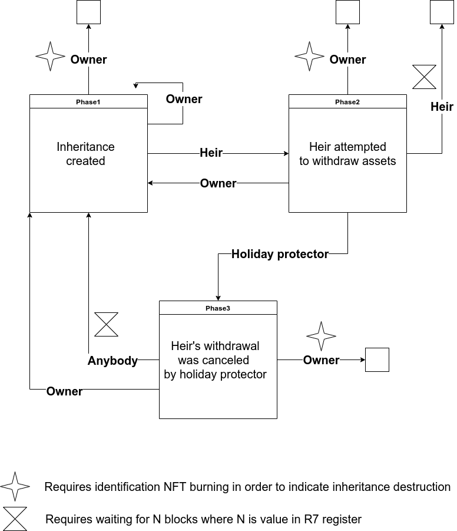

Non-custodial decentralized inheritance solution
============================================

* Author: nitram147
* Status: Proposed
* Created: 31-May-2022
* Last edited: 31-May-2022
* License: CC0
* Forking: not needed

Introduction & Motivation
--------------------------------------------

Main motivation of this proposal is to provide a standard which enables targeted users to use, manage and 
bequeath their assets according to their free will, giving them full control over their funds and giving 
them freedom to do so.

Unfortunately, in many countries freedom of people is being heavily suppressed by various forms of abusive laws. 
One of the main purposes of cryptocurrencies is to bring back freedom to anyone who desires it, and this EIP
aims to provide a solution for restricted financial freedom. Typically, even if some "better" governments 
do not impose heavy constraints on financial freedom of a living person, they still heavily regulate what will
happen with one´s property after he dies.

More often than not there are no options for deceased to freely express what they wish to happen with their 
belongings after their death. For example, there may exist restrictions regarding passing their belongings 
only to specific family members and there doesn´t exist any legal way to bypass this restrictions. 

Therefore, the purpose of this proposal is to define a standard for dApp, which will enable those affected 
people to fully regain their financial freedom. 

Analysis of problem
--------------------------------------------

There exist many ways of delegating an inheritance to one´s heirs. These can be generally divided to 2 main categories: custodial (i.e. those where we have to rely on third parties 
(for example a lawyer)), and non-custodial (which does not require us to trust anybody). 

In traditional life, inheritance is being passed on to heirs using a custodial service, typically with a help of notary. However, this approach can bring up great risks, especially when dealing with a larger amounts of assets. In the case of bequesting belongings in the form of a cryptocurrencies deposited on a wallet, which has its seed stored in a will held by a notary, there exists a not negligible chance of misusing this information by a notary at the expense of owner and heirs. This can be a substantial problem especially when dealing with inheritance in a form of cryptocurrencies, as transactions are ineradicable and once stolen, 
an inheritance can be considered irretrievably lost. Because of this, custodial approach is unsatisfactory when dealing with a crypto-heritage. Furthermore, notaries are obliges to act under the law in all circumstaces, thus not allowing the owner to freely choose to whom, and in what form, he wants to bequest the heritage, as discussed earlier.

One of the non-custodial ways of preserving a heritage is the use of a wallet, which has its key divided using shamir secret sharing scheme. After choosing proper parameters, let´s say 3 out of 7, 7 new keys are generated, from which at least 3 need to be known to restore the original key. The user can then split these 7 keys to close family and friends. For the family to gain access to the inheritance, all 3 members would have to agree on withdrawing the heritage without the owner´s permission. As can be seen, such solution is much more acceptable than the traditional (custodial) one. However, even this solution can lead to deceiving the owner during his life (for example in the case of family disagreement). 

Assuming the owner is the one and only who can operate with his property while being alive, this solution proposes a way of distributing the inheritance to heirs according to owner´s free will after his death (for example using the shamir secret sharing scheme), while maintaining a full control over his property while he is alive.

Proposed solution
--------------------------------------------

Few keywords definitions:
Inheritance owner - creator of inheritance
Inheritance heirs - people who will get inheritance in case that the inheritance owner has died

The root of the solution idea is a special smartcontract (phase 1) which will allow inheritance owner to withdraw his inheritance funds anytime, but his heirs could withdraw the funds only to the special smartcontract (phase 2) from which it could be spent by heirs after elapsing of predefined time. During this time, the inheritance owner has the ability (if he's still alive) to cancel this heirs withdrawal transaction thus preventing his heirs from cheating on him via attempting to steal his funds stored in the inheritance. Of course, somebody could argue that heirs could always kill the inheritance owner but based on the assumption that most of the people are "good" ones, there is much more higher change that if the inheritance is protected by a way proposed in this proposal it would be good enough to disincentivize most of the heirs from attempting to cheat the inheritance owner (some of the heirs could have some life problems emergency motivation to steal the funds, but they aren't motivated enough to psychically hurt the inheritance owner in order to prevent him from canceling heirs withdrawal).

As is obvious from the above proposed solution, the inheritance owner has to regulary check whether the heirs tried to cheat him or not in order to be able to cancel their withdrawal on time. However, there can be situation in the owners life when he would be able to do so for limited amounts of time eg. during holidays. For this purpose we introduce a person (or a computer script) which we will reffer to as holiday protector. The goal of this holiday protector would to be cancel any withdrawals during the time when the inheritance owner is away (eg. on holiday). This has to be however done in a clever way because we need to limit how many heirs withdrawals attemps can the holiday protector cancel in order to prevent "Denial-of-Service" attack from the side of holiday protectors against the heirs in case of owner's death.



On the picture above we can see the high level overview of proposed solution. Fund are deposited to special box (with special register values described bellow) located at the smartcontract address "Phase1". Heirs can then move the funds from the "Phase1" to "Phase2" and until some time they can spend box from "Phase2" to anywhere they want. However during this waiting either the owner or the holiday protector can cancel the heirs withdrawal. Holiday protector cancel the withdrawal via providing special value and spending of box from "Phase2" to "Phase3" address while preserving all the box settings (only consuming nanoErg for transaction fee from the box). After some time elapsed (same amount of time as is waiting time for heirs withdrawal), anybody can spent this box from "Phase3" to "Phase1" address, thus the whole cycle can repeat itself if needed. Owner can spent all the fund thus destroying the inheritance from any box any time, only requirement is to destroy special identification NFT which is included in the inheritance box in order to signalize that the inheritance was destroyed. Owner could also "drain" (see the `owner_draining` spending path in smartcontracts) some money from his inheritance while not preserving the inheritance intact. This way owner can even hold the whole belongings in the inheritance. If something bad accidentaly happened to him, his heirs will got his belongings, while holding the funds on the inheritance smartcontract does not prevent him from using those fund for spending for things during ordinary days.

Scaling
---
For the sake of easier implementation, smartcontracts are designed in that way that the addresses of all three phases all the same for any Ergo user's. Trivial implementation for the dApp (or the wallet implementing this solution) would be to scan all the boxes belonging to the before mentioned smartcontracts and go over box by box while checking whether some of the box don't belong to the user (owner or heir). This solution is however not going to scale well. Thus I'm proposing the following scaling solution.

Each user have to special smartcontract addresses which are unique to him. Boxes sent to this addresses are used as an indication for the user that he is either the owner or the heir of some inheritance. User will check for the transaction in which were boxes for his owners and heirs address created. User than check for the NFT id which was minted in this transaction - this NFT will be always contained in the inheritance box thus simplify it's search. Once the inheritance is destroyed this NFT should be also destroyed in order to indicate that the inheritance do not exists anymore.

Here are the ErgoScript source for calculation of Owner's and Heir's indication addresses:

```Scala
{
	val purpose = "inheritance"
	val role = "owner"
	val uniqueBoolHack = purpose == role || true
	sigmaProp(uniqueBoolHack && PK("owner_address"))
}
```
```Scala
{
	val purpose = "inheritance"
	val role = "heir"
	val uniqueBoolHack = purpose == role || true
	sigmaProp(uniqueBoolHack && PK("heir_address"))
}
```
Holiday protector and financial incentivization
---
In order to prevent holiday protector from doing DoS attact on the heirs, the following procedure is proposed - the inheritance box stores special hash value, the holiday protector can spent this box from "Phase2" to "Phase3" address only in case that he can provide new hash value to the outputs box which is the preimage value of the hashvalue. If he did so, the new hashvalue (equal to the hash preimage) is stored in the box. Owner will calculate long enough hashchain before the creation of the inheritance. He can then reveal value by value (going backwards in chain) each time allowing the holiday provider to do one withdrawal cancelation. In order to financialy incentivize the holiday protector for doing his job, the owner could craft special box containing the hash preimage and the inheritance identification NFT id to the following smartcontract:

R4[Coll[Byte]].get - preimage of blake2b256 hash from inheritance box
R5[Coll[Byte]].get - id of inheritance box identification nft 
```Scala
{

	val hash_preimage = SELF.R4[Coll[Byte]].get
	
	val phase2_box = INPUTS(0)
	val phase3_box = OUTPUTS(0)

	val preimage_used = phase3_box.R6[Coll[Byte]].get == hash_preimage
	val preimage_valid = blake2b256(phase3_box.R6[Coll[Byte]].get) == phase2_box.R6[Coll[Byte]].get

	val nft_id = SELF.R5[Coll[Byte]].get

	val contain_nft = anyOf(OUTPUTS(0).tokens.map{ (token: (Coll[Byte],Long)) => token._1 == nft_id })

	val all_ok = preimage_used && preimage_valid && contain_nft

	all_ok

}
```
Box should be spent as second input in transaction, together with inheritance box from phase2 address at first input. This way, the holiday protector can earn the funds saved in this box while doing his job. No interaction between the two (owner <-> holiday protector) is needed. This concept is similar for passive interaction between the ErgoMixer users.

Phase1,2,3 smartcontracts
---
Bellow you can see the smartcontract definition for the before mentioned phases from the diagram picture.
Inheritance box is created in special transaction which:

Has 1-N inputs

Has following outputs:

1.) PHASE1_HERITAGE_CONTRACT_ADDR: inheritance assets (ERG + tokens) +new special NFT (equal to the id of first input box)

R4[SigmaProp] - sigmaprop of owner pubkey
R5[SigmaProp] - sigmaprop of heir pubkey
R6[Coll[Byte]] - blake2b256 hashed value (holiday protection)
R7[Int] - blocks value (amount of blocks)
R8[Coll[Byte]] - indentification NFT id
R9[Coll[Byte]] - blake2b256 hash of phase1 contract propositionBytes

2.) OWNER_INDICATION_CONTRACT_ADDR: MIN_NANO_ERGS

3.) HEIR_INDICATION_CONTRACT_ADDR: MIN_NANO_ERGS

4.) SERVICE_FEE_ADDR: SERVICE_FEE

5.) CHANGE_ADDR: change (optional - if any)

6.) MINER_FEE_ADDR: MINER_FEE

Phase1
```Scala
{
	
	val owner = SELF.R4[SigmaProp].get
	val heir = SELF.R5[SigmaProp].get

	val nft_id = SELF.R8[Coll[Byte]].get

	val contain_nft = {(output_box: Box) => anyOf(output_box.tokens.map{ (token: (Coll[Byte],Long)) => token._1 == nft_id })}

	val nft_spent = !(OUTPUTS.exists(contain_nft))

	val sent_back_to_itself = OUTPUTS(0).propositionBytes == SELF.propositionBytes
	val sent_to_phase2 = blake2b256(OUTPUTS(0).propositionBytes) == fromBase64("phase2_propBytes_hash_base64")
	
	val registers_preserved = {
		OUTPUTS(0).R4[SigmaProp].get == SELF.R4[SigmaProp].get &&
		OUTPUTS(0).R5[SigmaProp].get == SELF.R5[SigmaProp].get &&
		OUTPUTS(0).R6[Coll[Byte]].get == SELF.R6[Coll[Byte]].get &&
		OUTPUTS(0).R7[Int].get == SELF.R7[Int].get &&
		OUTPUTS(0).R8[Coll[Byte]].get == SELF.R8[Coll[Byte]].get &&
		OUTPUTS(0).R9[Coll[Byte]].get == blake2b256(SELF.propositionBytes)
	}
	
	val ergs_preserved = OUTPUTS(0).value >= (SELF.value - 10000000L)
	val min_ergs = OUTPUTS(0).value >= (11000000L)
	
	val tokens_preserved = OUTPUTS(0).tokens == SELF.tokens

	val all_preserved = registers_preserved && ergs_preserved && tokens_preserved

	val owner_spending = owner && nft_spent
	val owner_draining = owner && min_ergs && sent_back_to_itself && registers_preserved && (!nft_spent)
	val heir_spending = heir && sent_to_phase2 && all_preserved

	owner_spending || owner_draining || heir_spending

}
```
Phase2
```Scala
{

	val owner = SELF.R4[SigmaProp].get
	val heir = SELF.R5[SigmaProp].get
	val holiday_protector_hash = SELF.R6[Coll[Byte]].get

	val blocks_delay = SELF.R7[Int].get

	val nft_id = SELF.R8[Coll[Byte]].get

	val contain_nft = {(output_box: Box) => anyOf(output_box.tokens.map{ (token: (Coll[Byte],Long)) => token._1 == nft_id })}

	val nft_spent = !(OUTPUTS.exists(contain_nft))

	val sent_to_phase1 = blake2b256(OUTPUTS(0).propositionBytes) == SELF.R9[Coll[Byte]].get
	val sent_to_phase3 = blake2b256(OUTPUTS(0).propositionBytes) == fromBase64("phase3_propBytes_hash_base64")
	
	val registers_preserved_without_R6 = {
		OUTPUTS(0).R4[SigmaProp].get == SELF.R4[SigmaProp].get &&
		OUTPUTS(0).R5[SigmaProp].get == SELF.R5[SigmaProp].get &&
		OUTPUTS(0).R7[Int].get == SELF.R7[Int].get &&
		OUTPUTS(0).R8[Coll[Byte]].get == SELF.R8[Coll[Byte]].get &&
		OUTPUTS(0).R9[Coll[Byte]].get == SELF.R9[Coll[Byte]].get
	}
	
	val ergs_preserved = OUTPUTS(0).value >= (SELF.value - 10000000L)
	val min_ergs = OUTPUTS(0).value >= (11000000L)

	val tokens_preserved = OUTPUTS(0).tokens == SELF.tokens

	val all_preserved = registers_preserved_without_R6 && ergs_preserved && tokens_preserved

	val hash_of_preimage_in_output = blake2b256(OUTPUTS(0).R6[Coll[Byte]].get)

	val hash_preimage_ok = holiday_protector_hash == hash_of_preimage_in_output

	val enough_time_elapsed_for_heir_withdrawal = HEIGHT >= (SELF.creationInfo._1 + blocks_delay)

	val registers_preserved = {
		registers_preserved_without_R6 &&
		OUTPUTS(0).R6[Coll[Byte]].get == SELF.R6[Coll[Byte]].get
	}

	val owner_spending = owner && nft_spent
	val owner_draining = owner && min_ergs && sent_to_phase1 && registers_preserved && (!nft_spent)
	val heir_spending = heir && enough_time_elapsed_for_heir_withdrawal && nft_spent
	val holiday_protector_spending = hash_preimage_ok && sent_to_phase3 && all_preserved

	owner_spending || owner_draining || heir_spending || holiday_protector_spending
	
}
```

Phase3
```Scala
{

	val owner = SELF.R4[SigmaProp].get

	val holiday_protector_hash = SELF.R6[Coll[Byte]].get

	val blocks_delay = SELF.R7[Int].get

	val nft_id = SELF.R8[Coll[Byte]].get

	val contain_nft = {(output_box: Box) => anyOf(output_box.tokens.map{ (token: (Coll[Byte],Long)) => token._1 == nft_id })}

	val nft_spent = !(OUTPUTS.exists(contain_nft))

	val sent_to_phase1 = blake2b256(OUTPUTS(0).propositionBytes) == SELF.R9[Coll[Byte]].get
	
	val registers_preserved = {
		OUTPUTS(0).R4[SigmaProp].get == SELF.R4[SigmaProp].get &&
		OUTPUTS(0).R5[SigmaProp].get == SELF.R5[SigmaProp].get &&
		OUTPUTS(0).R6[Coll[Byte]].get == SELF.R6[Coll[Byte]].get &&
		OUTPUTS(0).R7[Int].get == SELF.R7[Int].get &&
		OUTPUTS(0).R8[Coll[Byte]].get == SELF.R8[Coll[Byte]].get &&
		OUTPUTS(0).R9[Coll[Byte]].get == SELF.R9[Coll[Byte]].get
	}
	
	val ergs_preserved = OUTPUTS(0).value >= (SELF.value - 10000000L)
	val min_ergs = OUTPUTS(0).value >= (11000000L)

	val tokens_preserved = OUTPUTS(0).tokens == SELF.tokens

	val all_preserved = registers_preserved && ergs_preserved && tokens_preserved

	val hash_of_preimage_in_output = blake2b256(OUTPUTS(0).R6[Coll[Byte]].get)

	val hash_preimage_ok = holiday_protector_hash == hash_of_preimage_in_output

	val enough_time_elapsed_for_anybody_withdrawal = HEIGHT >= (SELF.creationInfo._1 + blocks_delay)

	val owner_spending = owner && nft_spent
	val owner_draining = owner && min_ergs && sent_to_phase1 && registers_preserved && (!nft_spent)
	val anybody_spending = enough_time_elapsed_for_anybody_withdrawal && sent_to_phase1 && all_preserved

	owner_spending || owner_draining || anybody_spending

}
```

Reference implementation
--------------------------------------------

todo InERGitance dApp description (overview)

ErgoPlayground
--------------------------------------------

to be done (smartcontracts showcased in various scenarios)
